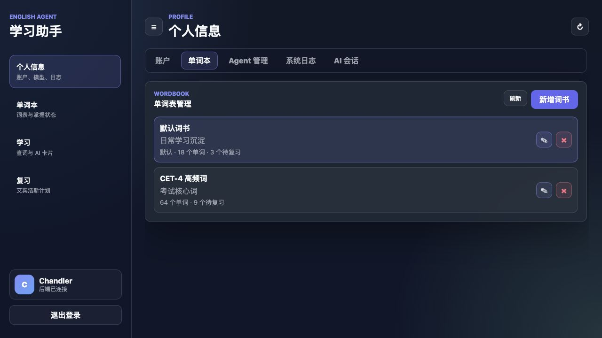
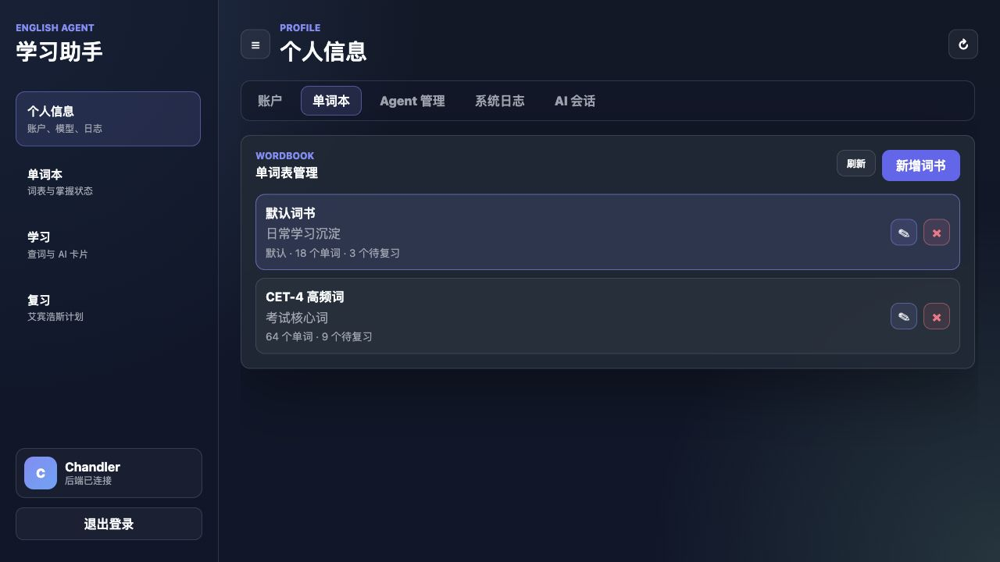
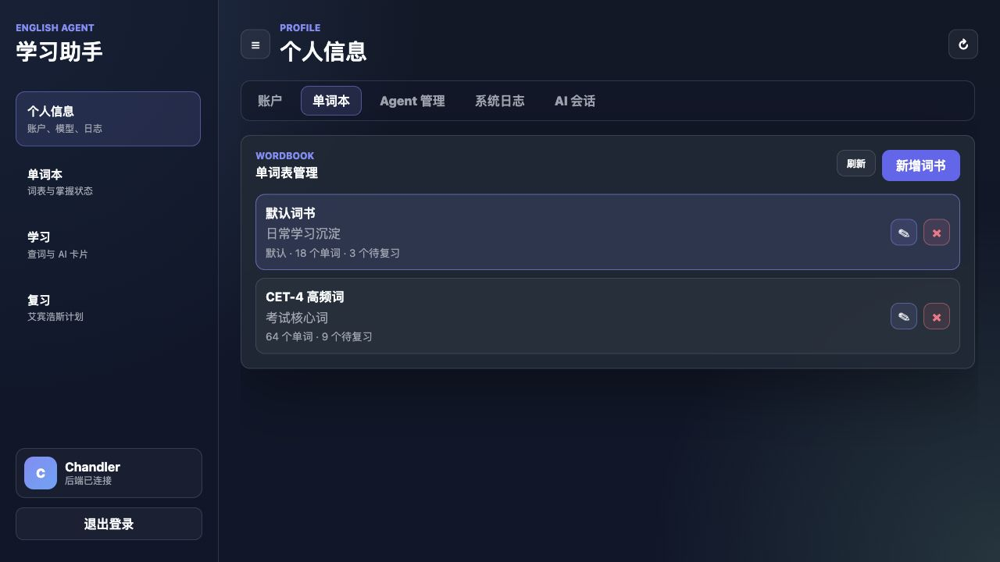

# 英语学习助手产品介绍与使用文档

## 1. 产品定位

英语学习助手是一款面向英语词汇学习的 AI 学习工作台。它把 AI 查词、结构化学习卡片、单词本、复习计划、学习笔记和系统日志放在同一个产品界面中，目标是减少重复调用 AI 的成本，并把每次学习结果沉淀到数据库中。

核心能力包括：

- 调用已配置的 AI 模型生成单词学习卡片。
- 将 AI 返回结果解析为释义、例句、搭配、相关词、记忆提示等结构化数据。
- 将学习结果、模型原始返回、单词本、笔记和复习记录保存到系统中。
- 基于单词掌握状态和复习结果生成后续复习计划。
- 支持模型配置、Agent 模板配置、系统日志和 AI 会话排查。

## 2. 页面总览

### 2.1 个人信息与学习活跃图

个人信息页展示账号概览、词书数量、单词数量、待复习数量和学习活跃图。活跃图参考 GitHub 贡献图，用于快速观察最近一段时间的学习和复习频率。

### 2.2 Agent 管理

Agent 管理用于维护 AI 模型和学习模板。模型列表展示供应商、模型明细、Base URL、优先级、启用状态和默认状态；学习 Agent 区域用于选择 Agent、模板和默认发音；模板编辑区支持查看和修改模板完整内容。

### 2.3 英语学习页

学习页用于输入单词或短语并生成学习卡片。页面优先展示释义、例句、记忆提示，其次展示搭配、相关单词和标签。音标旁提供 UK/US 发音按钮，例句也支持播放声音。

### 2.4 单词本详情

单词本页支持选择词书、按掌握状态筛选、查看单词详情、修改笔记、标记熟练程度和跳转复习。单词详情中展示音标和对应发音按钮，便于在查看词表时直接听读。

### 2.5 复习页

复习页支持选择词书和复习数量，进入跟敲复习。输入正确后展示例句和复习结果选择；忘记时会打开详情弹窗，帮助重新理解单词核心内容。

### 2.6 二次确认

删除、清空、模型修改、模型启停、学习 Agent 修改、学习 Agent 模板切换和模板保存都会触发二次确认，避免误操作影响学习数据或 AI 调用配置。

## 3. 主要使用流程

### 3.1 登录或注册

打开系统后，输入账号和密码，点击“登录”进入学习工作台。没有账号时点击“注册”，系统会创建账户并初始化默认词书。

### 3.2 配置 AI 模型

进入“个人信息 -> Agent 管理”，点击“新增模型”。填写模型名称、供应商、模型明细、Base URL、Chat Path、API Key 和顺序。保存后模型会出现在模型列表中。

编辑已有模型时，点击模型行右侧编辑图标，修改后保存。保存前系统会弹出二次确认。

启用或停用模型时，点击模型行右侧启停按钮。系统会先弹出确认框，确认后才会切换状态。

### 3.3 配置学习 Agent 和模板

在“个人信息 -> Agent 管理”中，可以选择学习 Agent、学习模板和默认发音。切换学习 Agent 或模板时，系统会弹出二次确认，避免未保存的模板内容被覆盖。

模板编辑区可以修改模板名称、类型、排序、标签、描述、示例输入、示例输出和模板内容。模板内容必须包含声明的占位符，例如 `{{term}}`。点击“保存模板”后，系统会先校验占位符，再弹出保存确认。

### 3.4 生成学习卡片

进入“学习”页面，在输入框中输入英语单词或短语，点击“学习”。系统会优先读取数据库缓存；如果没有缓存，会调用默认或选中的 AI 模型生成学习卡片，并把结果保存到数据库。

点击“重新生成”会强制重新调用 AI，适用于想刷新学习卡片内容的场景。

### 3.5 加入单词本

学习卡片生成后，点击单词标题区右侧的“＋”按钮，选择目标词书。系统会把单词加入该词书，并生成后续复习计划。

### 3.6 管理单词本

进入“单词本”页面，选择词书后查看单词列表。可以按“熟悉、模糊、遗忘”筛选。点击某个单词后，右侧展示详情，包括释义、音标、发音、例句、记忆提示、搭配、相关单词和笔记。

点击“熟练程度”可以修改单词状态；点击“编辑笔记”可以维护 Markdown 笔记；点击“去复习”会跳转到复习页面。

### 3.7 复习单词

进入“复习”页面，选择词书和数量，点击“开始复习”。系统会展示复习卡片，用户按字母跟敲单词。输入完成后会出现例句弹窗，可以选择“忘记了、有点模糊、记住了”。

复习结果会影响掌握状态、熟练度和下次复习时间。

### 3.8 查看日志和 AI 原始返回

进入“个人信息 -> 系统日志”可以查看系统记录的操作日志。进入“个人信息 -> AI 会话”可以查看最近一次 AI 模型返回的原始数据，用于排查模板、解析和缓存行为。

## 4. 操作保护规则

以下操作会弹出二次确认：

- 删除模型配置。
- 启用或停用模型。
- 修改模型配置。
- 修改学习 Agent。
- 切换学习 Agent 模板。
- 保存学习 Agent 模板。
- 删除词书。
- 删除单词。
- 清空系统日志。

确认弹窗中的“取消”不会执行任何数据变更。

## 5. 使用建议

- 优先维护一个默认模型，并保持启用状态。
- 模板修改前先确认 `{{term}}` 等占位符完整，避免 AI 生成结果无法解析。
- 学习页普通查询会优先使用缓存；只有需要刷新内容时再点击“重新生成”。
- 单词本中的笔记建议记录个人记忆线索、易混词和典型搭配。
- 复习时根据真实记忆情况选择结果，系统会据此调整复习节奏。
