# 宝贝激励助手界面操作文档

本文档用于说明 1.0 版本的主要界面和核心操作流程。系统分为家长端和宝贝端：家长负责配置、审核和维护奖励履约；宝贝负责查看任务、打卡、兑换奖励和确认礼物。

## 1. 登录与注册

打开前端地址后进入登录页。左侧轮播展示当前系统的核心能力：个人信息与余额、宝贝成长、任务管理、任务日历打卡、奖励商店、奖励日历履约；右侧输入账号和密码登录。点击“注册”会打开注册弹窗，需要填写账号、密码、手机号码和邀请码。

操作要点：

- 家长账号登录后可看到完整导航：个人信息、宝贝成长、任务日历、奖励日历、奖励商店、系统配置。
- 宝贝账号登录后只显示个人信息首页、任务日历、奖励日历、奖励商店。
- 登录状态会缓存在浏览器中，一段时间内刷新页面不需要重新登录。

## 2. 个人信息

个人信息首页用于查看当前选中宝贝的余额、今日完成率、礼物兑换券和积分流水。余额区域点击后可查看完整货币图标，并可进行货币兑换；“兑换奖励”会跳转到奖励商店。

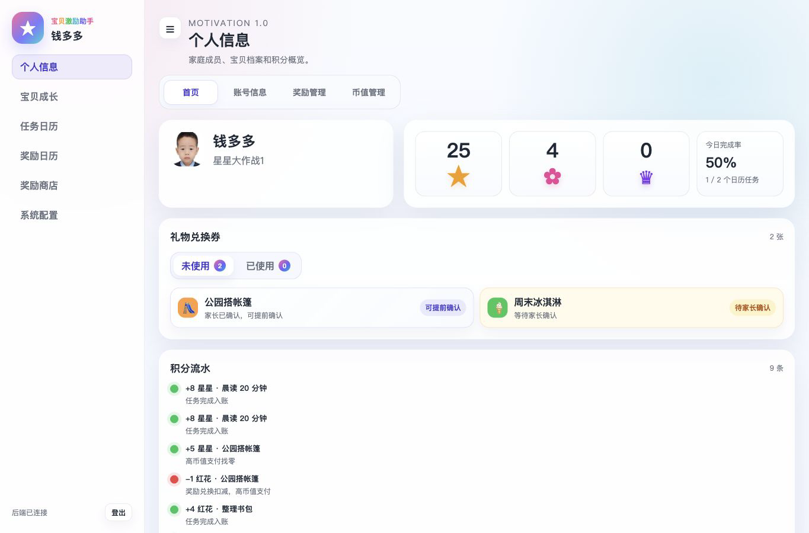

### 2.1 账号信息与宝贝档案

账号信息页包含三块：当前账号、宝贝档案、宝贝成长日志。家长可修改账号昵称和头像，头像会经过裁剪与压缩后保存到数据库。

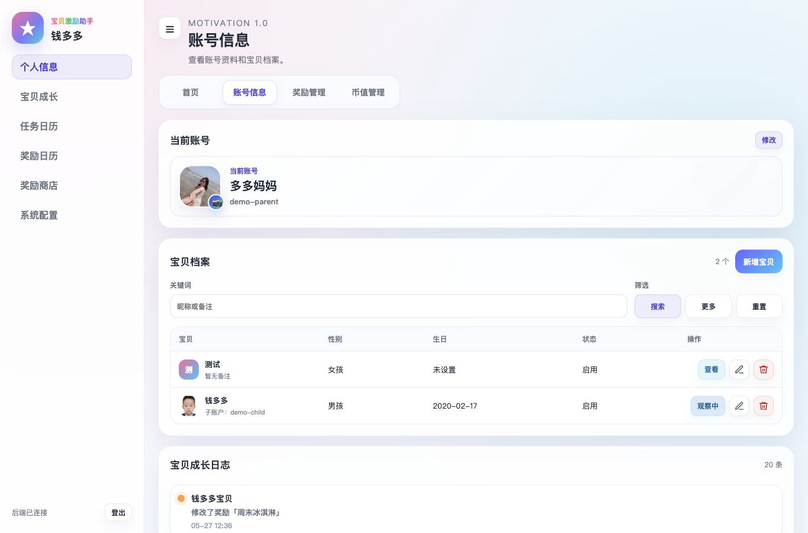

宝贝档案操作：

- 点击“新增宝贝”创建档案，可选择是否创建子账号。
- 已创建子账号的档案会显示子账号入口，并支持查看密码和修改密码。
- 点击“查看”会把该宝贝设为当前观察对象；已选中的宝贝按钮显示“观察中”。
- 修改宝贝生日时使用中文日期选择器。

## 3. 宝贝成长

宝贝成长页分为“成长目标”和“任务管理”两个子导航。成长目标用于定义长期方向，任务管理用于配置每日、每周、每月任务。

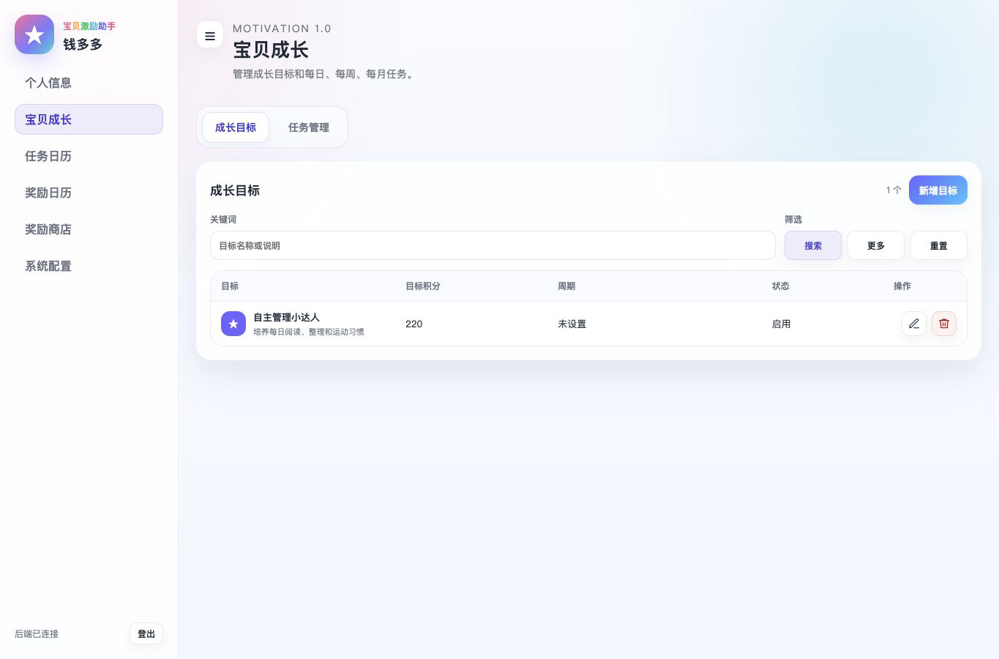

### 3.1 成长目标

家长可新增、修改、删除成长目标。目标包含名称、图标、颜色、状态和说明。图标使用选择框弹出图标面板，说明放在弹窗底部。

### 3.2 任务管理

任务列表默认按更新时间倒序展示。列表支持关键词模糊搜索，更多筛选项默认折叠，避免挤压操作按钮。

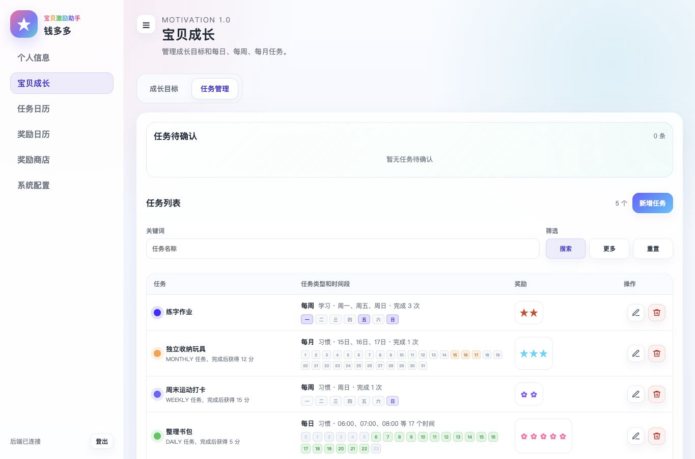

新增或修改任务时重点配置：

- 任务类型：每日、每周、每月。
- 时间段：每日使用 24 个方块点选；每周选择星期；每月选择日期。
- 完成次数：最低 1 次，例如每周选择周一、周四、周五，完成 2 次即可。
- 色彩：任务颜色会同步到时间方块和日历任务块。
- 奖励类型：选择 1 级、2 级或 3 级货币，并设置奖励数量。
- 积分生效方式：打卡生效或审批后生效。

## 4. 任务日历

任务日历支持月视图和周视图，右上角“今天”按钮可聚焦当天。日期数字大小和颜色可在系统配置中调整。

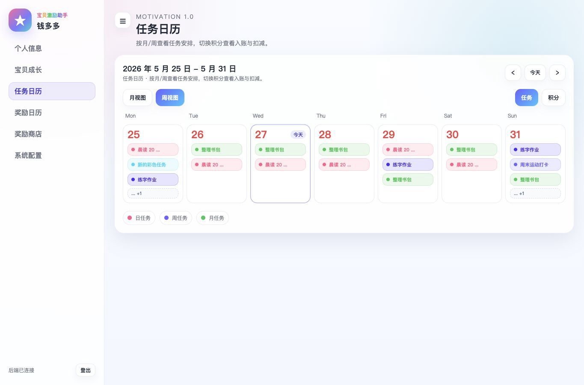

点击某个日期会打开当日任务弹窗。家长可以在弹窗右侧快速新增当日任务；宝贝和家长都可以在这里发起打卡。

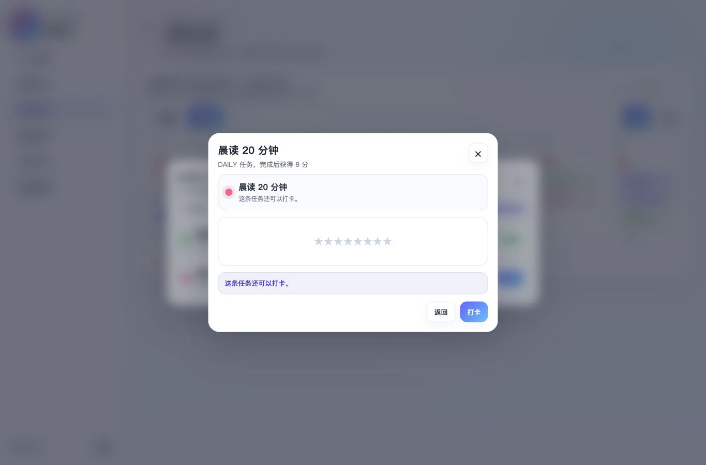

打卡弹窗会展示“你的奖励预览”。默认全部奖励图标高亮，左侧“−”从右侧减少奖励数量，右侧“+”增加奖励数量，也可以直接点选图标数量。

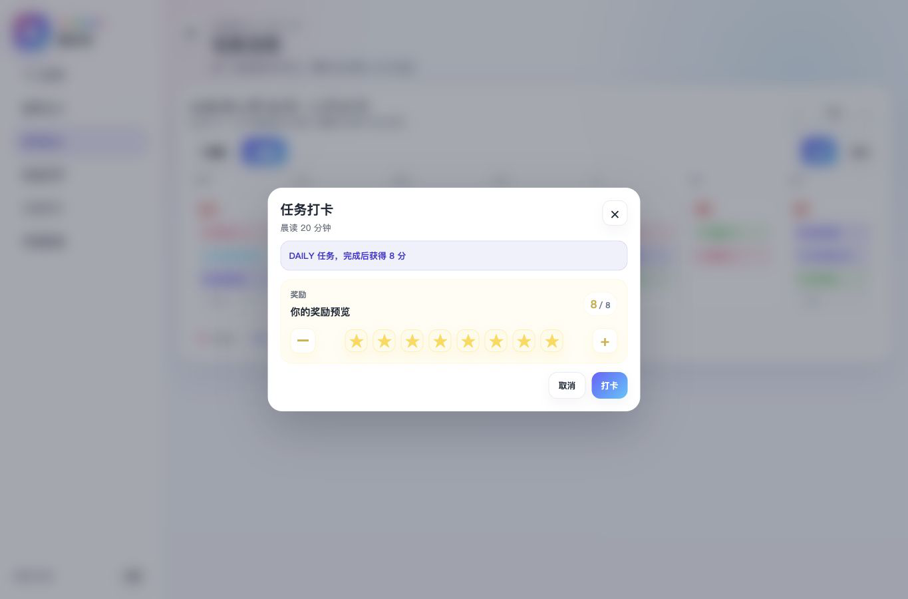

打卡规则：

- 宝贝侧打卡时，如果任务设置为审批后生效，会进入家长待确认。
- 家长侧打卡不需要审批，直接入账。
- 每次积分变化都需要生成积分流水，不能只改余额。

## 5. 奖励商店

奖励商店展示可兑换奖励。奖励卡片显示图标、名称、描述和兑换所需货币。

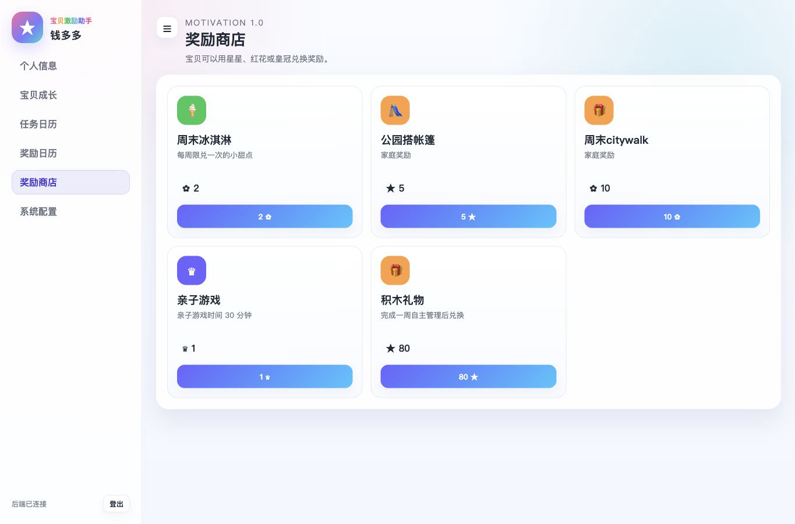

点击奖励后打开兑换弹窗。弹窗上方显示礼物所需消耗，下面显示当前余额；如果目标货币不足，会提示是否可以用更高币值货币购买并找零。

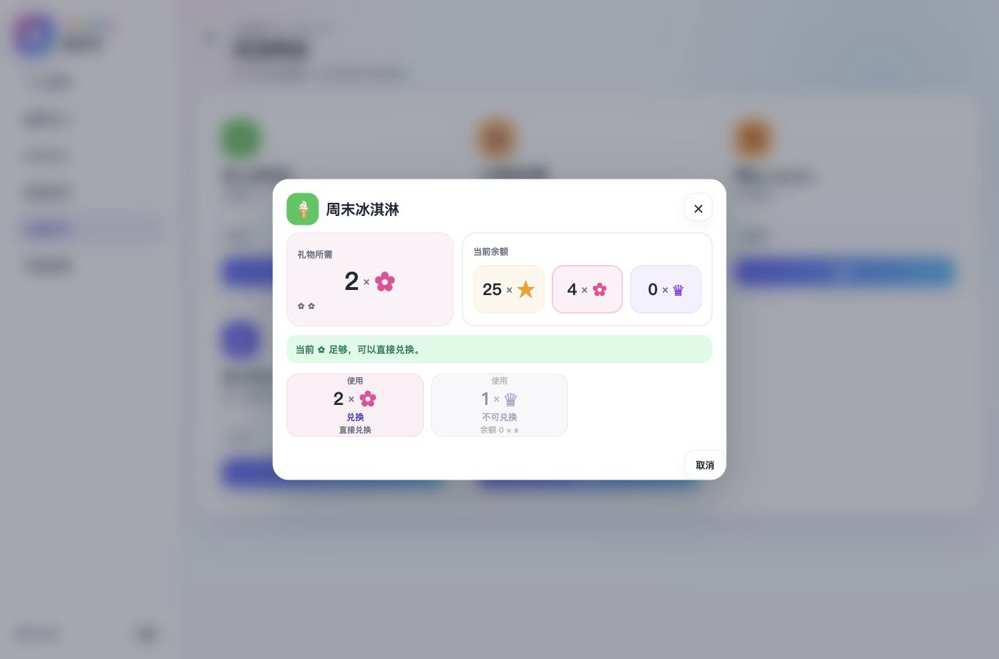

兑换规则：

- 宝贝侧兑换时会先判断余额是否足够，并把审批中的占用一起计算。
- 家长侧兑换不需要审批，成功后直接进入后续履约流程。
- 兑换成功后宝贝会获得礼物兑换券；家长确认后的兑换券，宝贝可以提前确认。

## 6. 奖励管理

奖励管理用于维护奖励和处理兑换待办。家长可新增、修改、删除奖励，配置图标、颜色、所需货币、库存和实现方式。

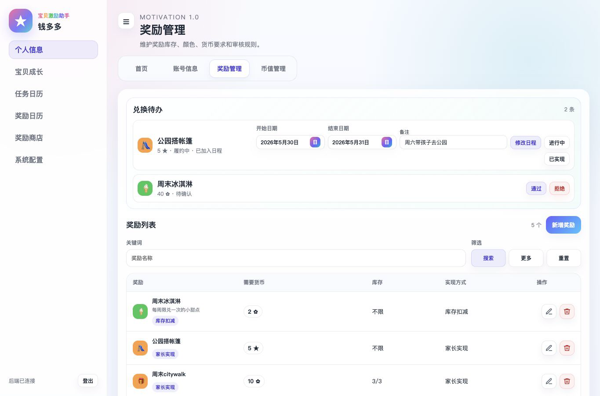

奖励实现方式：

- 库存扣减：家长确认后进入待宝贝确认。
- 家长执行：家长确认并完成后，宝贝确认。
- 家长购买：家长确认 -> 家长已下单 -> 奖励运输中 -> 奖励已到货 -> 宝贝确认。
- 家长实现：家长确认 -> 家长加入日程 -> 奖励进行中 -> 已实现 -> 宝贝确认。

待办区域最多显示 3 条，超过后使用“更多”展开。通过或拒绝兑换时会写入业务日志和兑换状态。

## 7. 奖励日历

奖励日历把每个兑换奖励变成日历中的具体对象。家长可在日历日期中维护奖励流程；宝贝端只能查看奖励信息和状态。

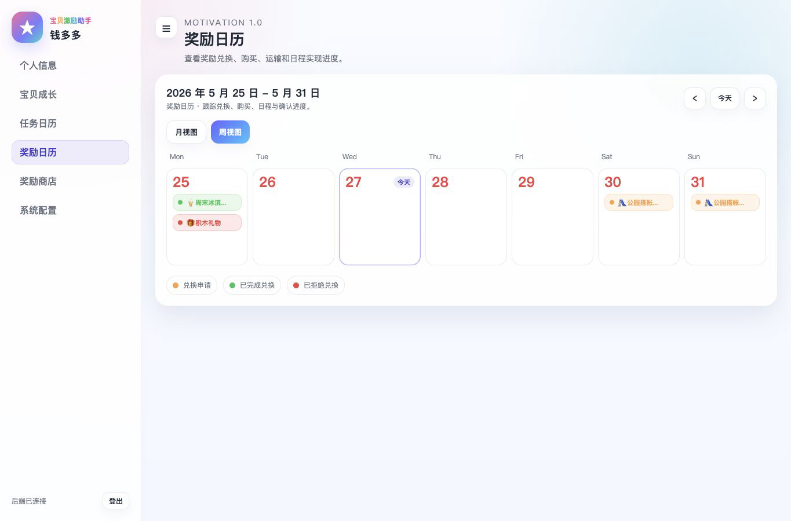

点击奖励可查看奖励详情。详情中会展示奖励描述、兑换消耗、主流程、分支流程和当前状态。

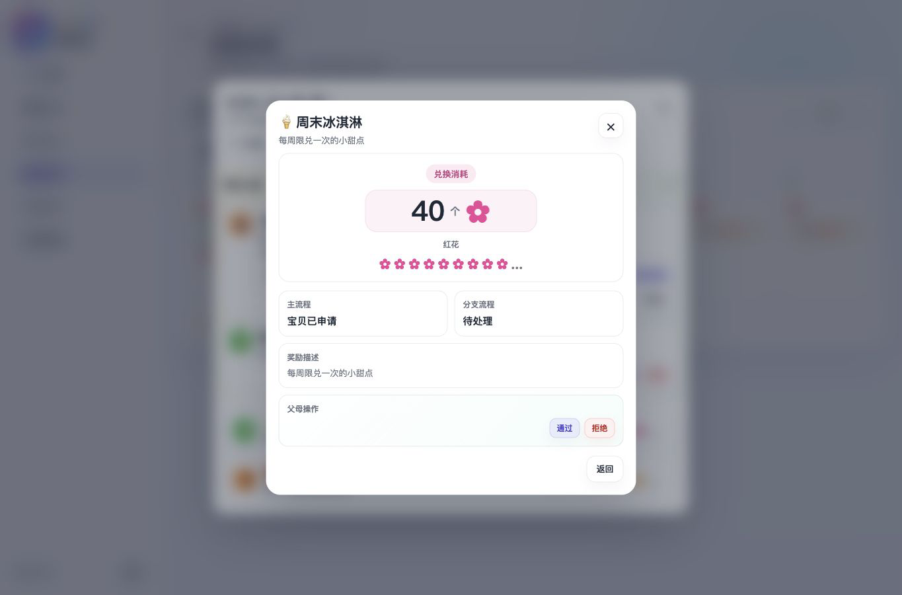

家长常用操作：

- 家长购买：在日期中选择待办礼物，更新为已下单，填写预计到达时间；后续再更新为运输中、已到货。
- 家长实现：在日期中选择待办礼物，设置开始时间、结束时间和备注；到执行当天更新为进行中，完成后更新为已实现。
- 已加入日程的奖励允许修改日程；进入进行中后不能再修改日程。

## 8. 系统配置

系统配置当前提供“日历样式”，可调整任务日历中的日期大小和颜色。月视图或周视图的选择会记录为操作者偏好，后续进入任务日历或奖励日历时沿用上次选择。

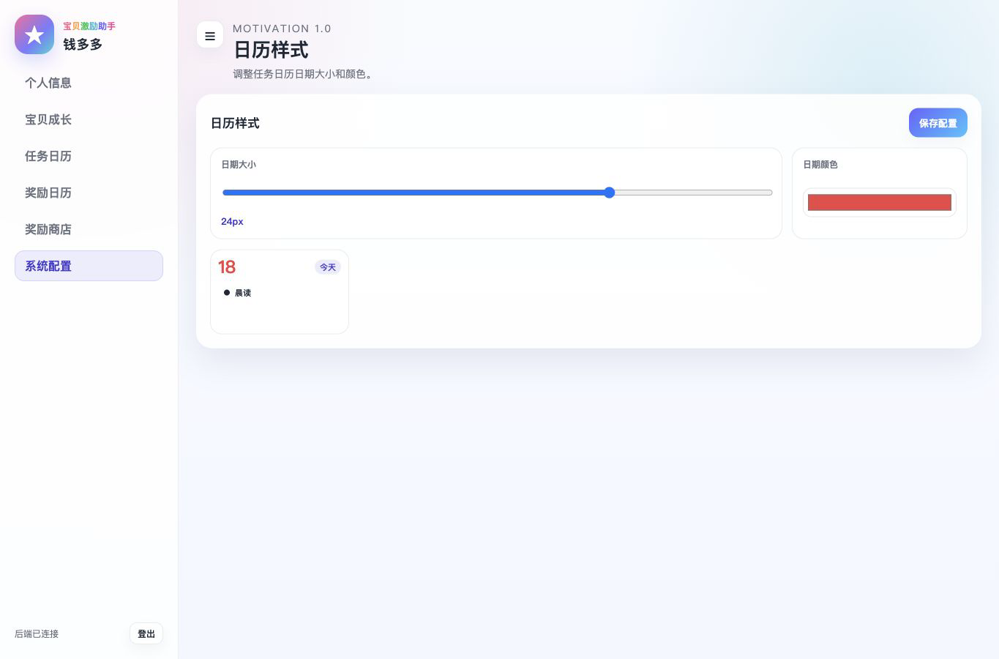

## 9. 宝贝端使用建议

宝贝端只保留低干扰操作：

- 在个人信息首页查看余额、礼物兑换券和积分流水。
- 在任务日历查看今日任务并打卡。
- 在奖励商店兑换礼物。
- 在奖励日历关注礼物状态和动态，最终确认礼物。

界面尽量使用大图标、数量和颜色表达状态，减少对文字理解的依赖。

## 10. 运营注意事项

- 新增任务或奖励前，先确认当前观察的宝贝是否正确。
- 删除任务或奖励会二次确认，避免误操作。
- 任务、奖励、积分、兑换券、成长日志和操作日志都应落库，避免只保存在浏览器中。
- 货币类型按 1 级、2 级、3 级配置，低级货币币值不能超过高级货币的最小币值。
- 家长处理兑换待办和任务待确认时，应补充清晰备注，方便后续追踪业务流转。
