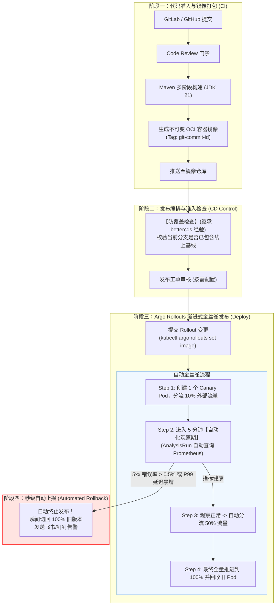

# 方向二：基于云原生新技术的自动化流水线与灰度发布设计

> **核心观点**：发版环境的自动化与渐进式灰度发布，绝非大厂的专属玩具，而是**适合绝大多数中小及中大型公司的普适刚需**。  
> 关键在于**避免从零重复造轮子**（如老系统 `bettercds` 维护上千个文件去手写底层 K8s Patch 与发布状态机），而是采用**“轻量级审批管理 + 云原生金丝雀标准引擎（Argo Rollouts）”**的现代解法。

---

## 一、 为什么自动化发版流水线“适合绝大多数公司”？

### 1. 绝大多数公司的发版现状与痛点
1.  **全量“一刀切”重启**：每次发版所有 Pod 一起滚动，新版本一旦有致命 Bug（如空指针、SQL 语法错误），100% 流量瞬间报错，引发 P0 级故障；
2.  **人肉蹲守日志**：发版时多名工程师眼睛死盯终端 `tail -f app.log`，费时费力且很难在海量日志中敏锐捕捉错误率上升；
3.  **回滚链路漫长**：发生故障时慌忙重新打包旧版本或手动修改 Deployment 镜像，平均故障恢复时间（MTTR）长达 10~30 分钟。

### 2. 现代解法的核心突破
通过引入 **Argo Rollouts + Ingress-Nginx / APISIX + Prometheus 指标门禁**：
*   **研发不用写一行复杂的发布脚本**，声明一个标准 YAML 即可拥有顶级大厂的金丝雀发布能力；
*   **流量按百分比平滑切分**（例如先切 10% 流量到新版本 Pod）；
*   **机器代替人肉做决策**：Prometheus 自动分析灰度 Pod 的 5xx 错误率与响应耗时，指标劣化直接**自动秒级回滚**！

---

## 二、 新一代自动化流水线整体架构



---

## 三、 核心工业级配置模板（开箱即用）

### 1. 声明式金丝雀发版定义：`rollout.yaml`
使用 Argo Rollouts 替代传统的 K8s `Deployment`，支持定义精确的权重阶梯与观察门禁：

```yaml
apiVersion: argoproj.io/v1alpha1
kind: Rollout
metadata:
  name: order-service
  namespace: prod
spec:
  replicas: 5
  strategy:
    canary:
      # 关联的 Ingress 网关名称与流量切分配置
      trafficRouting:
        nginx:
          stableIngress: order-service-ingress
      # 核心发版步骤定义
      steps:
        # 步骤 1：切入 10% 流量到新版本
        - setWeight: 10
        # 步骤 2：启动自动质量门禁分析，观察 3 分钟
        - analysis:
            templates:
              - templateName: success-rate-analysis
            args:
              - name: service-name
                value: order-service
        # 步骤 3：分析通过后，扩大切流至 30% 并暂停 2 分钟
        - setWeight: 30
        - pause: { duration: 2m }
        # 步骤 4：扩大切流至 60%
        - setWeight: 60
        - pause: { duration: 2m }
        # 最终全量滚动更新
  revisionHistoryLimit: 5
  selector:
    matchLabels:
      app: order-service
  template:
    metadata:
      labels:
        app: order-service
    spec:
      containers:
        - name: order-service
          image: harbor.internal.net/prod/order-service:v2.1.0
          lifecycle:
            preStop:
              exec:
                command: ["/bin/sh", "-c", "curl -X POST http://127.0.0.1:8080/actuator/service-registry?status=DOWN && sleep 15"]
          readinessProbe:
            httpGet:
              path: /actuator/health/readiness
              port: 8080
            initialDelaySeconds: 15
            periodSeconds: 5
```

---

### 2. 自动化质量门禁定义：`analysis-template.yaml`
替代人肉盯日志，让 Prometheus 充当 24 小时在线的质量裁判：

```yaml
apiVersion: argoproj.io/v1alpha1
kind: AnalysisTemplate
metadata:
  name: success-rate-analysis
  namespace: prod
spec:
  args:
    - name: service-name
  metrics:
    - name: success-rate
      interval: 30s
      count: 5
      # 允许连续失败的最大次数（超过则直接判定发版失败，触发回滚）
      failureLimit: 1
      provider:
        prometheus:
          address: http://prometheus-k8s.monitoring.svc:9090
          # 查询目标微服务在最近 2 分钟内的 HTTP 请求成功率
          query: |
            sum(rate(http_server_requests_seconds_count{app="{{args.service-name}}",status!~"5.*"}[2m]))
            /
            sum(rate(http_server_requests_seconds_count{app="{{args.service-name}}"}[2m]))
      # 成功率必须大于等于 99.5%，否则触发告警与回滚
      successCondition: result[0] >= 0.995
```

---

## 四、 从老系统 `bettercds` 传承的关键发布保障

虽然我们采用 Argo Rollouts 替代了 `bettercds` 庞大的底层引擎，但 `bettercds` 中沉淀的两项高价值规范必须在流水线前端保留：

### 1. 基线防覆盖检查（Baseline Verification）
*   **风险场景**：开发者 A 基于 3 天前的分支发版，上线后直接把昨天开发者 B 刚合入上线的代码冲刷覆盖掉。
*   **流水线实现**：  
    在流水线触发构建前，执行 Git 脚本：
    ```bash
    # 检查主干基线是否已完整 merge 进待发布分支
    git fetch origin master
    BEHIND_COUNT=$(git rev-list --count HEAD..origin/master)
    if [ "$BEHIND_COUNT" -gt 0 ]; then
      echo "【发布阻断】当前分支落后于 master 基线 $BEHIND_COUNT 个提交，请先合入 master 重新测试后再发版！"
      exit 1
    fi
    ```

### 2. 二方库/Starter 版本合规校验（Dependency Safety）
*   像老系统的 `validateProductDependencyVersionErrorV2` 一样，在 Maven 编译阶段强制校验业务工程中引用的 `infra-bom` 版本是否属于受支持的安全版本，严禁使用快照版（SNAPSHOT）或已知含严重漏洞的旧版本上生产。

---

## 五、 本发布流水线对多数公司的收益总结

1. **研发心智负担骤降**：业务团队只需要提交代码合并，发版过程全自动分流、全自动验证指标，无需人工手动介入；
2. **故障半径缩减 90%**：即使代码存在重大漏洞，也仅有 10% 的灰度流量会受影响，且会在 1~2 分钟内被 Prometheus 指标门禁识别并自动撤回；
3. **运维与平台维护成本极低**：由于依托 Kubernetes 标准 CRD（Argo Rollouts），平台团队无需维护数十万行的自研调度代码，基础设施随社区持续迭代升级。
