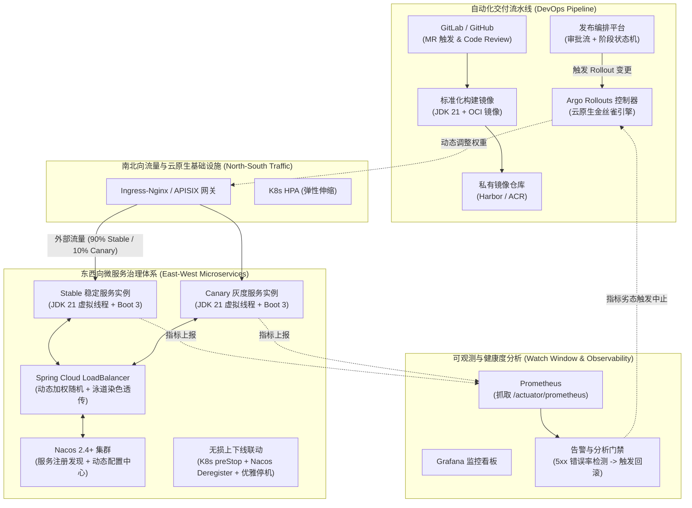

# 新一代云原生微服务基座与自动化发布流水线架构方案
> **Project**: `chandler26-tech-foundation`  
> **Target Stack**: JDK 21 LTS + Spring Boot 3.3/3.4 + Spring Cloud 2023/2024 + Nacos 2.4+ + Kubernetes / Argo Rollouts  
> **Heritage**: 深度传承自企业级生产环境（技术保障/基础架构/中间件/DevOps）的大规模治理经验，去粗取精，基于现代技术全面重构。

---

## 一、 背景与定位

在分析企业现有私有云与微服务基础设施（70+ 核心工程，包含 `bettercds`、`proplus`、`consul-starter`、`registryplus`、`gatewayplus` 等）的过程中，我们提炼出其卓越的**企业级治理经验**（如生产配置审批防错、动态权重灰度分流、优雅下线防任务倾泻等），同时也识别出了其**技术包袱与历史局限**（如厚重 SDK 维护成本高、Consul/ZK/自研管控割裂、底层发布引擎过度自研导致单体臃肿等）。

本项目旨在构建一个**通用的、现代化的技术基座**，重点攻克两大方向：
1. **方向一：新一代微服务基座（服务治理核心）**  
   拥抱 JDK 21（虚拟线程）、Spring Boot 3.x 及 Nacos 2.4+，通过极简的统一 BOM 和轻量化 Starter，实现**毫秒级动态配置治理、业务级加权灰度路由、全链路泳道染色与全自动无损上下线闭环**。
2. **方向二：普适现代企业的发布流水线（发版环境自动化）**  
   破除传统自研发布平台深陷底层 K8s Patch 与脚本运维的困局，采用**“轻量级发布编排平台 + Argo Rollouts (云原生金丝雀) + Ingress/Gateway API”**，打造一套开箱即用、低维护成本、适合绝大多数公司的自动化安全发版流水线。

---

## 二、 架构文档目录索引

本方案沉淀了完整的技术演进设计、治理原则与落地实施细节，各章节文档如下：

| 章节文档 | 核心主题 | 解决的核心问题 |
| :--- | :--- | :--- |
| [01. 微服务治理基座体系设计](./01-microservice-governance-architecture.md) | **服务治理与核心运行时** | • Nacos 2.4 统一注册与配置 • Spring Cloud LoadBalancer 动态加权灰度 • 无损上下线与调度任务防倾泻闭环 • 吸收 `proplus` 的配置审批与 Diff 审计 |
| [02. 自动化交付流水线与灰度发布](./02-automated-delivery-pipeline.md) | **环境自动化与金丝雀发版** | • 适合中大型企业的自动化发版流水线 • Argo Rollouts 云原生金丝雀切流控制 • 自动指标监控观察期门禁（Watch Window） • 秒级止损的一键/自动回滚机制 |
| [03. 微服务与云原生的能力取舍法则](./03-cloud-native-vs-microservices-tradeoff.md) | **技术边界与架构决策** | • 为什么微服务与 K8s 会能力重叠？ • 黄金法则：南北归云原生，东西归微服务 • 避免引入 Service Mesh 重型复杂度的务实解法 |
| [04. 统一 BOM 依赖规范与 PoC 实施指南](./04-bom-and-quickstart-poc.md) | **工程落地与本地实验** | • 彻底规避“依赖地狱”的统一 BOM 规范 • 业务端极简 `infra-core-starter` 规范 • 基于本地 Docker Desktop K8s 的 PoC 验证步骤 |

---

## 三、 整体架构全景图

---

## 四、 核心设计准则

1. **“厚平台，轻 SDK”（Thin SDK, Rich Platform）**  
   严禁重蹈老系统 20 多个 Starter 的覆辙。业务微服务仅引入一个极简的脚手架依赖，所有中间件版本与公共拦截器完全透明对齐。
2. **“南北归云原生，东西归微服务”**  
   外部入口粗粒度分流与 Pod 调度交给 K8s / Ingress；内部 RPC 高性能直连、泳道染色与动态参数热修，坚决交由 Nacos 与 Spring Cloud 在进程内完成。
3. **“发版质量由机器判定，而非人肉观察”**  
   将金丝雀发布的“观察期”从肉眼盯日志，升级为自动化抓取 Prometheus 核心指标（错误率、延迟），异常瞬时自动触发回滚。
