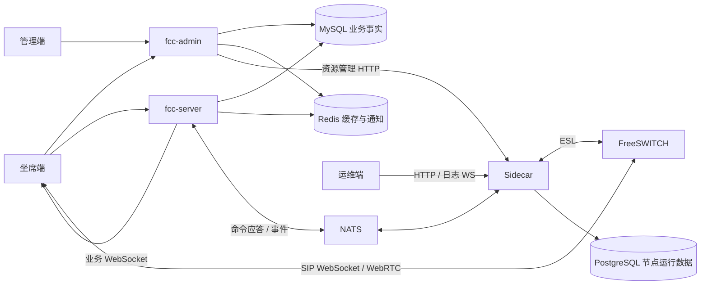

# FCC 产品设计总览与完善清单

核对日期：2026-09-23。范围为 Java 21 FCC、管理端、坐席端、Go Sidecar 与 FreeSWITCH 运维端；Java 17 FCC 仅作为前代验证参考。产品为全新系统，无旧业务兼容要求。本文区分源码现状与待实现验收目标，不以页面、DDL 或接口存在认定能力可用。

七项高优先级契约问题已进行修复或明确禁用，见 [处理及部署记录](fcc-contract-remediation.md)。下列 P0/P1 是完整能力验收目标，其中身份绑定、本人 SIP 配置、提交后通知和严格定义校验已有实现；完整故障恢复和真实媒体闭环仍未完成；弹屏激活回执已有持久记录。

## 1. 用户与工程责任

| 用户/工程 | 责任 | 不负责 |
| --- | --- | --- |
| 管理员、运营 / admin-web + fcc-admin | 账户、组、终端、分机、Flow Model、客户资料和自动外呼的维护/查看入口；话单、录音、回拨及运行结果查看 | 直接执行 Flow action、调度外呼、连接 ESL 或控制媒体 |
| 坐席、班长 / client-web | 登录、接听、人工外呼、话中操作、话后整理、回拨工作及授权弹屏摘要 | 维护客户主数据、创建自动外呼调度或判断未收到的软交换最终结果 |
| fcc-server | 固定已发布 Flow 版本并执行；Call/Leg 关联、话机绑定运行流程、呼入/呼出、自动外呼事实与调度、客户事实、弹屏业务编排及业务 WebSocket | 提供管理端页面、直接连接 ESL、直接调用坐席电脑的 Windows API |
| Windows 坐席客户端（测试安装包） | 接收服务端事件，执行本机通知、窗口恢复、任务栏提示；回传接收、展示、激活或不支持状态，服务端持久记录 | 自行决定客户归属、外呼调度与弹屏业务规则 |
| 通信运维 / fswitch-web + Sidecar | 节点、注册、网关、话道、协议翻译、运行数据 | 客户资料、技能路由、业务话单定义 |
| FreeSWITCH | SIP、Channel、Bridge、媒体及录音写入 | FCC 账户及业务授权 |

## 2. 系统连接与事实来源

MySQL 保存业务事实；PostgreSQL 反映节点运行数据及 Sidecar 管理数据，两者不能互当同一话单来源。Redis 和内存索引可加速查询，但不能替代持久恢复。业务 WebSocket、SIP 注册和媒体连通是独立状态，任何一个在线都不能推导另两个健康。

身份边界：callId 是业务通话，channelUuid 是一个话道，ctrlId 是控制关联，nodeId 是节点，bridgeUuid 是媒体关系；命令、事件、流程实例和业务外部标识另有身份。Long 标识符字符串序列化当前仅覆盖共享模块匹配的 Bean 属性，仍需实际 HTTP 契约验证。

管理链路为 `admin-web -> fcc-admin -> fcc-server`。fcc-admin 校验 `business:manage` 后转发当前会话令牌；fcc-server 在线回查 `/api/admin/auth/me`，只接受数据库当前仍启用、主体类型为 `CONSOLE` 且具备 `business:manage` 或 `*` 的账号。客户与自动外呼不在 admin 和 server 各存一份：admin 是维护/查看控制面，server 是事实与执行面。坐席端不包含客户管理和自动外呼任务管理工作台。

## 3. 业务链路现状

| 链路 | 当前源码具备 | 尚缺的闭环 |
| --- | --- | --- |
| 开通坐席与终端 | 账户、终端绑定、随机加密分机口令、Sidecar 开通、本人授权 SIP 配置 | 开通失败重试补偿与凭据轮换管理 |
| 呼入与外呼 | REST/FNode、事件处理、会话索引、弹屏、接听入口 | 全链路实测、并发归属校验、事件驱动最终态与重启恢复 |
| 保持、DTMF、挂机、转接 | 前后端入口及部分底层指令 | 明确命令受理/失败/未知/完成，转接失败恢复与单一 DTMF 发送责任 |
| 班长监控与干预 | 坐席名单；他人状态未知；干预前端禁用、后端拒绝 | 权威在线状态；真实监听/耳语/强插/强拆及权限审计 |
| 流程定义 | 公共动作目录、五个完整系统模型、固定阶段画布、分页版本、草稿/发布、严格校验及按通话执行轨迹 | 运行端按已发布定义驱动完整动态编排、持久发布重试、激活确认与无话务仿真 |
| 话单与录音 | 分页、统计、详情、录音元数据与读取入口；桥接后幂等开始/停止录音，未知停止状态可对账 | 最终事实核对、录音完成/缺失状态、授权与审计联调 |
| 回拨 | 查询、指派、发起入口 | 并发领取、重复发起保护、失败重试、结果与源 Call 对账 |
| 运维 | 节点/注册/话道查询、排水、部分资源操作、离线提示 | 访问控制、操作审计、节点计数重建、事件重放与告警 |

普通呼叫的验收顺序应为：登录与终端注册 → 发起/接入 Call → 建立双方 Leg → 振铃/接听 → Bridge 与双向音频 → 控制/录音 → 双方挂机 → CDR/录音核对 → 坐席释放与话后整理。当前源码并不证明这条完整序列已经通过。

呼入流程以 DID 被叫号码作为入口：号码主数据绑定稳定 flow key，来电时再固定该流程最新已发布版本。号码不属于版本 JSON。同一流程可承接多个 DID，一个 DID 同时只能进入一个流程；没有启用 DID 的流程不得发布。管理端现已提供 DID 绑定、首个草稿、只读已发布版本和明确 if/else 兜底维护，仍需真实 XSwitch/Sidecar 来电验证 `dest_number` 与运营商送号一致。

## 4. 高优先级：首个可用版本前必须补齐

2026-09-19 决策：自动外呼调度、客户资料、Windows 弹屏业务均归属 fcc-server；Windows 外壳仅执行本机交互。按 [分阶段实施清单](fcc-delivery-plan.md) 推进，该清单是执行顺序与状态的唯一来源。下表保留跨阶段发布门槛，不代表所有条目都需要同时开工。

以下为待办与验收条件，不是已交付能力。

| 优先级 | 完善项 | 交付验收条件 |
| --- | --- | --- |
| P0 | 登录身份、通话归属及权限 | 话务 REST、业务 WS 绑定认证主体；伪造 workNo、跨坐席控制、无权限录音/班长操作均被拒绝；缺少 callId 不选择全局最近通话 |
| P0 | 真实命令结果 | 无会话、节点不可用、RPC 失败返回可识别错误；不提前终结 Call；前端保留 pending/未知并以事件或查询对账 |
| P0 | SIP 凭据与开通闭环 | 每坐席独立配置，认证后按终端授权发放、可撤销/轮换；不将共享真实密码打进 Vite 包；Sidecar 开通失败可见且可重试 |
| P0 | 双向通话最小闭环 | 至少覆盖呼入/外呼、接听/拒接、双方挂机、忙线/无应答、双向音频和对应 CDR；保留命令/事件/Call/Leg 关联证据；拨号不能把终端注册在线投影作为同步硬前置 |
| P0 | 事件可靠性与恢复 | 稳定源 eventId、重复/乱序保护、终态幂等；失败事件最多 5 次显式重投，中断或耗尽后进入 UNKNOWN 对账；断网/重启后恢复活跃 Call、坐席占用与录音事实；补齐业务副作用与 Inbox 非同事务的恢复策略 |
| P0 | 流程发布正确性 | 服务端拒绝不支持的定义；提交后通知；编译失败保持旧版本并返回失败；显示每实例激活版本；运行通话固定版本 |

对于暂未实现的班长操作、仿真或完整规则路由，先明确不可用，避免继续返回或展示成功。

## 5. 第二阶段：形成完整呼叫中心业务能力

| 优先级 | 功能 | 完善内容与验收重点 |
| --- | --- | --- |
| P1 | ACD 技能组与排队 | 技能/优先级、空闲最长等策略、并发分配、排队超时/溢出/营业时间；记录每次路由依据，两个来电不能占用同一独占坐席 |
| P1 | 完整 IVR 运行闭环 | 固定阶段模型已覆盖播放、收号、分支、路由、桥接、通话中与结束动作；需验证真实按键/超时/错误出口、转人工和挂机都按固定版本执行，仿真不得触发生产话务 |
| P1 | 成熟业务细节显式建模 | 以旧系统多年运行闭环作为业务验收清单，补齐直达、营业时间、排队溢出、录音、评价、转接/三方和第三方业务回调；每项先定义公共 Action 和分支结果，再实现、留痕和联调，禁止继续藏在事件监听器条件中 |
| P1 | 转接与班长能力 | 明确盲转/咨询转语义；咨询失败回到原通话；实现真实监听/耳语/强插/强拆，并检查授权及媒体方向 |
| P1 | 坐席状态与 ACW | 服务端权威的上线、就绪、休息、忙、整理状态；心跳离线、跨终端切换、整理提交/超时释放可核对 |
| P1 | 录音生命周期 | 开始/停止/就绪/失败/缺失；权限与 Range 播放；下载审计、保留期限和清理；文件与事实不一致可修复 |
| P1 | 回拨工作流 | 原话单关联、原子领取、预约、尝试次数、退避重试、终态、处理记录；失败项可重试且不重复拨号 |
| P1 | 运营统计与观测 | 接通/未接/放弃、排队/通话/整理时长统一口径；从事实重算；按 Call 定位命令、事件、Leg、Bridge 和失败原因 |
| P1 | 节点与发布运维 | 就绪检查、排水、重连补建订阅、计数重建、存储告警、版本激活失败告警及恢复操作 |

## 6. 后续扩展与工程治理

自动外呼是 fcc-server 核心能力，按实施清单在基础通话可靠后交付，不再归为 P2 扩展。基础客户资料与客户来电关联随 Windows 弹屏交付。固定阶段可视化流程编辑、公共动作目录及三类执行器边界已经落地；外部 CRM/工单集成、可插拔自定义阶段与复杂循环、质量评价与检索、报表导出和预测式外呼属于后续扩展。

前端现有超过 600 行的组/CDR/分机视图继续按列表、详情、表单拆分；完善错误、长文本、移动敏感宽度与登录失效验证。分包优化、契约测试和生成产物治理与功能同步推进，不以行数降低替代正确性。

## 7. 部署与验证约束

- 编译需要 JDK 21，本轮使用本机 JDK 21 已通过 Java 编译；Go 以 go.mod 声明为准。仍需在 CI 和完整环境验证核心业务。
- Java 不再配置或读取 `FCC_DEFAULT_NODE_ID`；业务命令统一进入 `fs.cmd.dispatch`，由 Sidecar Coordinator 选择节点。Sidecar 仍配置自己的 `NODE_ID` 并发布节点事件/心跳；NATS、ESL、MySQL、PostgreSQL、Redis 均使用独立部署配置。当前只验证单节点 dispatch，跨节点 ownership 和聚合快照仍需联调。
- 开发 Vite 代理不代表生产代理。生产需分别路由管理 REST、话务 REST、业务 WS，并验证 HTTPS/WSS、证书、SIP 域、ICE/TURN 与双向音频。
- 录音目录需在 FreeSWITCH 写入端和 Java 读取端一致可见，验证路径边界、权限、容量和文件完成态。
- 新环境采用空库基线；仓库当前没有增量迁移脚本，也不支持旧库兼容升级。结构不一致的开发库应先备份再重建，不在运行库临时删列，也不导入演示坐席/话单。进入生产变更管理后再从当前基线建立不可变迁移链。
- 发布门槛：构建与契约测试通过；真实呼叫用例通过；权限否定用例通过；断网/重启恢复通过；数据和媒体完成态可核对。当前尚未达到此门槛。

## 8. 文档索引与证据边界

- [控制面设计](../chandler26-jdk21-fcc/docs/DESIGN.md)
- [Sidecar 设计](../../cloud-2025/chandler25-fs-sidecar-agent/docs/DESIGN.md)
- [前端架构](frontend-architecture-and-ui-design.md)
- [流程编辑现状](../chandler26-fcc-admin-web/docs/IVR_FLOW_ORCHESTRATION_DESIGN.md)
- [话单与录音](../chandler26-fcc-admin-web/docs/CALL_FLOW_AND_TRACE_DESIGN.md)
- [前后端契约检查](fcc-contract-alignment.md)
- [验证记录](testing-architecture-and-test-cases.md)

2026-09-23 本轮使用 JDK 21 完成编译、`fcc-common` 全量测试及录音/评价/拨号超时/事件/流程缓存/话务控制定向测试；Sidecar 使用 Go 1.27.1 完成全部生产包测试和构建。验证时临时启动 NATS Server 2.15.0 与 JetStream，应用成功连接 `nats://127.0.0.1:4222`。完整 `mvn -q test` 中 `fcc-server` 共运行 48 项，0 项断言失败、9 项环境错误、1 项跳过；Windows/JDK selector 无法建立 Lettuce Redis 事件循环，应用上下文提前失败，MySQL 业务 Schema 因而未完成本轮验证，不能记为全量通过。尚未完成 Sidecar 真实事件写入/重投、FreeSWITCH、SIP、媒体、录音完成态、真实阿里云 TTS、认证浏览器或 Windows 弹屏联调。当前实现、部署步骤及剩余阻断以 [跨电脑验收记录](fcc-cross-machine-acceptance.md) 为准。
