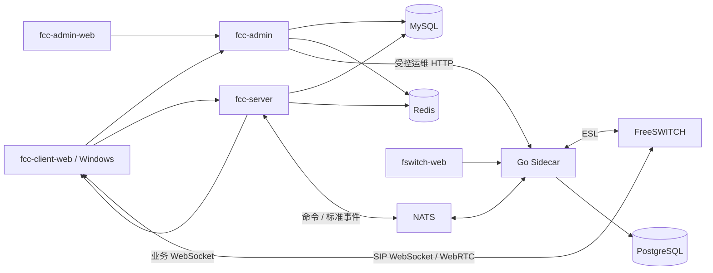

# FCC 产品设计

## 1. 产品定位

FCC 是一个全新的、基于 FreeSWITCH 的呼叫中心产品，不兼容旧呼叫中心的协议、流程 JSON、数据表或租户模型。`call-center-backend` 用于核对多年运行形成的业务闭环，`chandler26-jdk17-freeswitch-FCC` 用于参考已验证的 FNode/FreeSWITCH 链路；两者都不是新系统的代码模板。

本文只描述产品边界、当前能力和稳定决策。优先级与实施状态见 [交付计划](fcc-delivery-plan.md)，测试及真实环境验收分别见 [测试策略](testing-architecture-and-test-cases.md) 和 [跨电脑验收](fcc-cross-machine-acceptance.md)。

## 2. 用户与系统职责

| 用户或系统 | 主要职责 | 不负责 |
| --- | --- | --- |
| `fcc-admin-web` + `fcc-admin` | 管理员登录；坐席、组、终端、分机、DID、Flow Model、客户和自动外呼的维护/查看；话单、录音、回拨和运行结果查询 | 执行 Flow Action、调度外呼、连接 ESL |
| `fcc-client-web` + Windows 外壳 | 坐席登录、接听、人工外呼、话中操作、话后整理、回拨、来电弹屏和本机通知 | 维护客户主数据、创建自动外呼任务、决定业务路由 |
| `fcc-server` | 固定并执行已发布流程；话机绑定运行流程；呼入、两类人工外呼、自动外呼、客户匹配、弹屏、Call/Leg/Bridge 与执行事实 | 管理页面、直接连接 ESL、直接调用远程 Windows API |
| Go Sidecar | NATS/FNode 协议、ESL、标准事件、TTS 文件生成、通道快照、节点准入与 FreeSWITCH 运维接口 | 坐席、技能、客户、流程版本和自动外呼业务规则 |
| `fswitch-web` | 节点、注册、网关、Profile、Channel/Call、CLI 和日志运维 | 客户资料、坐席工作台、业务话单定义 |
| FreeSWITCH | SIP、Channel、Bridge、媒体、录音文件和拨号上下文 | FCC 账户、权限、业务流程和客户事实 |

管理原则是“在 admin 维护/查看，在 server 使用/执行”。这表示用例入口分离，不表示复制业务事实：客户和自动外呼事实由 `fcc-server` 保存，管理端通过受控接口维护和查询。

## 3. 系统边界

- MySQL 是 FCC 业务事实来源；Redis 和内存索引只保存可重建状态。
- PostgreSQL 保存 FreeSWITCH/Sidecar 运行数据，不能作为 FCC 业务话单来源。
- Java 只通过 NATS 和 Sidecar 控制 FreeSWITCH，不建立直接 ESL 连接。
- 业务 REST、业务 WebSocket、Sidecar 运维 HTTP、SIP/WebRTC 是独立通道，不能用一个“在线”状态代替另一个。
- `callId`、`channelUuid`、`ctrlId`、`bridgeUuid`、`commandId`、`eventId`、`flowInstanceId` 和 `nodeId` 含义不同，跨 Java、JSON、SQL 和 TypeScript 均不得混用。
- `fcc-server` 不选择 FreeSWITCH 节点。业务命令发送到逻辑入口 `fs.cmd.dispatch`；实际节点由 Sidecar/Coordinator 选择，`nodeId` 只作为应答、事件、审计和恢复事实返回。

## 4. 核心业务模型

### 4.1 终端与坐席状态

坐席可拥有 `WEBRTC`、`SIP`、`MOBILE` 三类终端绑定，但当前只能有一个活跃接听终端。绑定、活跃终端、SIP 注册投影和 `READY/BUSY/REST/ACW` 工作状态是四类独立事实。

- 物理 SIP 话机通过拨打 `0000`、输入工号完成绑定；管理端不能凭空创建物理话机绑定。
- Dial 需要启用的终端绑定和合法的业务状态，但不把最近一次注册在线投影作为同步硬前置。
- `MOBILE` 仅保留领域模型，当前运行能力未实现，不能降级为其他终端或返回假成功。
- 人工外呼支持两条独立链路：系统先呼坐席再呼客户；已认证坐席终端主动拨号后，系统接管现有坐席 Leg 再呼客户。

### 4.2 通话和流程

固定模型的唯一来源是 `fcc-common/src/main/resources/flows/system-models.json`：

| 模型 | 用途 |
| --- | --- |
| `INBOUND` | DID 入口、菜单收号、if/else 路由、坐席分配、桥接、录音、评价、结束语音和回拨收尾 |
| `AGENT_FIRST` | 系统先呼坐席，再呼客户并桥接 |
| `AGENT_ORIGINATED` | 接管已认证坐席终端发起的 Leg，再呼客户并桥接 |
| `NOTIFICATION` | 呼叫客户、TTS/预设媒体播放、按键确认和结果保存 |
| `PHONE_BINDING` | 识别已认证分机、收取工号、事务绑定并结束通话 |

流程编码唯一，同一流程最多一个已发布版本。管理员先保存草稿，再发布；新通话固定发布时的不可变版本，存量通话不随发布改变。运行端按需加载发布版本，Caffeine 写入后三小时过期、175 分钟后异步刷新；刷新失败保留旧快照，过期且无法重新加载时拒绝创建新实例。

呼入以 DID 被叫号码定位稳定 `flowKey`。DID 是入口主数据，不写进版本 JSON；同一流程可绑定多个 DID，一个 DID 同时只归属一个流程。Flow Studio 维护模型，话单详情展示实际通话经过的简化业务流和每个 Action 结果，不模拟缺失轨迹。

`FlowActionType` 是 admin 校验与 server 执行共用的动作目录：

- 每个 FCC/FNode 命令必须有对应动作；播放、收号、拨号、桥接、录音、转接和挂机不能伪装成内部动作。
- 内部动作只承载高内聚的业务闭环，例如 DID 解析、路由选择、坐席预占和收尾。
- 第三方动作只调用服务端预配置的 HTTPS 端点，使用版本化请求/响应协议；流程定义不能携带任意 URL、类名、脚本或表达式。

### 4.3 语音、录音和弹屏

Java 下发业务文案，Sidecar 使用配置的 TTS Provider 生成文件并原子写入与 FreeSWITCH 共享的工作目录。Java 不感知供应商密钥、Token 或合成协议。服务评价和结束语音使用受控预设；真实阿里云 TTS、共享文件和播放效果仍需外部环境验证。

FreeSWITCH 写录音文件，`fcc-server` 保存录音事实，`fcc-admin` 提供授权读取。登记路径或命令受理不等于文件已经完整落盘。

来电弹屏由 `fcc-server` 决定收件人、授权摘要、生命周期、补发和过期规则。Windows 外壳只执行本机通知、窗口恢复和回执；`RECEIVED/SHOWN/ACTIVATED/UNSUPPORTED` 回执不等于通话已经接听。

## 5. 当前能力与验证边界

| 领域 | 当前源码具备 | 尚未证明或尚未完成 |
| --- | --- | --- |
| 账户与终端 | 首个管理员 bootstrap、坐席/分机、独立 SIP 凭据、终端清单与切换、`0000` 绑定流程 | 真实话机并发换绑、凭据轮换和开通失败补偿 |
| 呼入与人工外呼 | DID 绑定、五类固定模型、两种人工外呼入口、Call/Leg/Bridge/Command/Event 事实 | 真实 SIP、双向媒体、异常事件顺序、跨重启完整恢复 |
| 流程维护 | 动作目录、分页摘要/详情、首个草稿、版本发布、if/else 兜底、执行轨迹 | 持久发布通知重试、多实例激活看板、无话务仿真 |
| 话中控制 | 挂机、保持、DTMF、转接入口；命令受理与最终事件分离 | 保持/DTMF 结构化 FNode 方法、咨询转/三方、班长监听/耳语/强插/强拆 |
| 客户与弹屏 | 客户事实、号码匹配、授权详情、弹屏持久化/补发/回执、Electron 测试外壳 | 签名安装包、自动更新、锁屏/专注助手/断网真实验收 |
| 自动外呼与回拨 | 通知型/渐进式任务、持久尝试、领取租约、时段频控、暂停/取消、回拨领取与关联 | 多实例调度、未知结果对账、真实并发与媒体闭环 |
| 录音与评价 | 路径登记、开始/停止动作、录音事件、评价与结束语音流程 | 文件完成态、时长/大小核对、保留清理和真实播放 |
| 节点与事件 | 单节点 dispatch、稳定 eventId、Sidecar outbox、JetStream/Java Inbox、通道快照 | 多节点 ownership、跨节点 Bridge、快照聚合、真实重投与单边残留恢复 |

源码和静态测试不能证明真实通话可用。当前仍需在具备 MySQL、Redis、NATS/JetStream、PostgreSQL、Sidecar、FreeSWITCH、SIP 终端、媒体和 Windows 的环境完成端到端验收。

## 6. 产品演进原则

- 先完成通信可靠性、真实双向通话和恢复，再扩展复杂路由与运营能力。
- 从旧系统抽取“业务输入、判断、动作、持久事实、外部通知、失败出口”，不复制隐藏条件分支或多 Topic 架构。
- 营业时间、排队溢出、代班、咨询转、三方、第三方业务回调等能力必须先进入公共动作目录，再由 admin 校验、server 执行并记录事实。
- 班长干预、手机接听和预测式外呼在真实实现前必须明确不可用，不能展示假成功。
- 增长型列表使用分页和紧凑摘要；流程定义、Leg、轨迹、录音元数据等大对象按详情加载。
- 全新开发阶段只支持空库基线，不兼容旧库。进入生产变更管理后再从锁定基线建立不可变迁移链。
