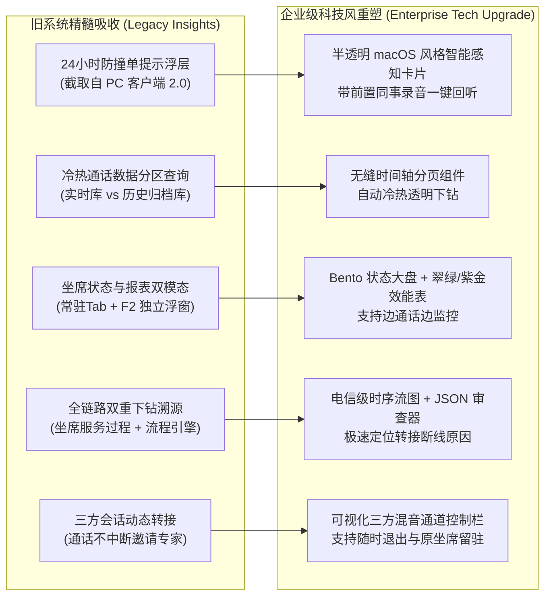
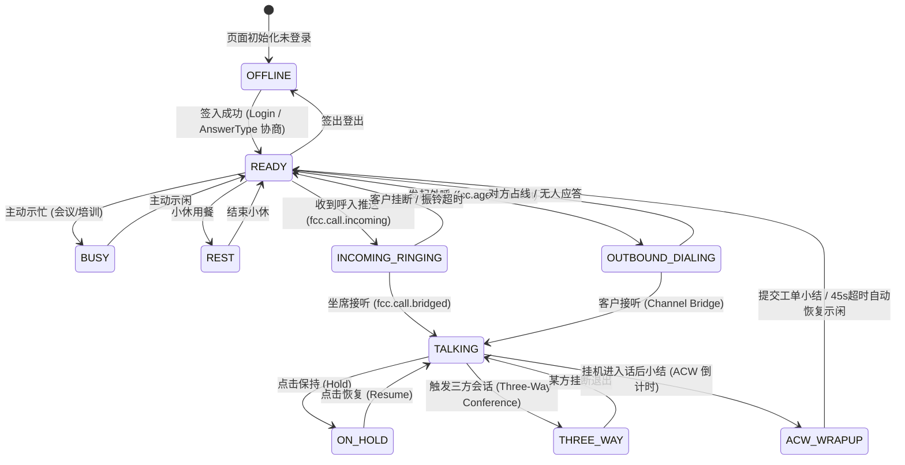

# FCC (FreeSWITCH Call Center) 现代企业级科技美学 (Enterprise Tech) 前端全栈架构与UI设计规范

> **系统定位**: 面向大中型企业与商业化呼叫中心的旗舰级客服工作台与运营管理平台  
> **设计语言**: **Next-Gen Enterprise Tech (次世代现代企业科技美学)** —— 融合 Linear/Apple/Stripe 级别的精致质感与现代克制科技动效，告别刺眼廉价的“极客黑客风”，打造高品质、抗疲劳、专业沉浸的商业级产品  
> **适用工程**: 
> - `chandler26-fcc-client-web` (坐席 PC 工作台 / 客户端)
> - `chandler26-fcc-admin-web` (综合运营管理与监控控制台)  
> **文档版本**: v3.0.0 (商业化重构版) | **日期**: 2026-09-17  
> **后端契约**: Spring Boot 3 + JDK 21 + FreeSWITCH 1.11.3 + NATS JetStream

---

## 1. 核心设计哲学：从“极客黑客”回归“现代企业级科技美学”

在企业级与商业化呼叫中心场景中，客服人员与运营主管每个工作日需持续盯屏 **8 小时以上**。
早期以荧光绿、刺眼霓虹青、生硬科幻字体的“极客黑客风（Cyberpunk/Hacker HUD）”虽然抓眼球，但存在严重问题：
1. **视觉侵略性过强**：长时间使用极易导致视疲劳；
2. **缺乏商业信任感**：过于偏向游戏或科幻电影道具，缺乏企业级软件的沉稳、严谨与高级感；
3. **信息层级混乱**：过多发光投影干扰了对核心话务状态（如接通时长、客户投诉等级、接听率）的第一时间读取。

### 1.1 现代企业级科技美学 (Enterprise Tech Aesthetics) 的四大原则

```
+----------------------------------------------------------------------------------------------------+
|                                MODERN ENTERPRISE TECH DESIGN SYSTEM                                |
+------------------+------------------+-------------------------+------------------------------------+
| 1. 克制与高级感   | 2. 润物细无声动效 | 3. 科学的信息密度       | 4. 严谨专业的商业语境              |
| (Refinement)     | (Micro-Motions)  | (Ergonomic Information) | (Enterprise Tone)                  |
| - 深邃钛灰蓝底色 | - 平滑滑块Tab切换| - Bento Grid 卡片层次   | - 告别中二口吻 (如 "CYBER-DECK")   |
| - 柔和半透明玻璃 | - 声波频谱平滑起伏| - 关键数据 0.2s 视觉聚焦 | - 标准电信术语: 实时话务控制/呼叫转接 |
| - 1px 精致微光边框| - 防撞单气泡平滑展开| - 一键复制/一键填入工单  | - 客户画像/24h通话前置智能雷达     |
+------------------+------------------+-------------------------+------------------------------------+
```

1. **克制与高级感 (Refinement & Elegance)**：
   - 底色采用深邃沉稳的**钛灰深蓝 (Titanium Slate & Obsidian Blue)**，替代死气沉沉的纯黑；
   - 采用精致的 `1px` 微弱边框（`rgba(255, 255, 255, 0.08)`）配合轻量玻璃拟态（`backdrop-filter: blur(16px)`），营造通透、层次分明的桌面质感。
2. **微动效赋能交互 (Purposeful Micro-Interactions)**：
   - 科技感不体现在花哨的故障纹（Glitch），而体现在**行云流水的顺滑反馈**：
     - **Sliding Tab Pill**：Tab 切换时光标滑块弹性移动，而非硬切；
     - **Acoustic Waveform**：通话对讲时声波根据真实语音电平平滑跳动；
     - **Smart Popover**：外呼输入框下方 24 小时防撞单提示带有柔和的淡入与微弹效果；
     - **Soft Breathing Indicator**：来电振铃时采用柔和光晕呼吸（Soft Ambient Glow），醒目而不刺目。
3. **符合人机工效的信息架构 (Ergonomic Layout)**：
   - 彻底拒绝单页平铺，通过 **Multi-Tab 工作空间** 归纳高频与低频模块；
   - 核心话务操作（接听/挂断/转接/三方/小结）放置在肌肉记忆最佳区域，保证 0.2 秒内极速触达。
4. **专业的商业级用语规范**：
   - 全面去除“CYBER-DECK”、“TELEMETRY 遥测”等科幻词汇，回归“**智能呼叫中心工作台**”、“**实时通话控制**”、“**通话网络质量**”、“**客户全景档案**”等标准企业级语言。

---

## 2. 吸收旧系统生产原型的核心商业价值

基于用户提供的 10 组生产旧系统截图，提炼出真正解决呼叫中心一线痛点的 5 大核心业务设计点：



### 2.1 业务价值升华要点
1. **24小时防撞单雷达 (Anti-Collision Intelligence)**：
   - **痛点**：跨团队/跨港口业务中，多个客服短时间内重复外呼同一个车队长或货主，引起客户强烈反感。
   - **设计方案**：输入号码时，系统自动在输入框下方以柔和半透明卡片提示：`拨打人: 陈松 (深圳港) | 拨打时间: 2026-09-17 14:28 | [ ▶️ 试听录音 ]`。坐席点击即可回听前置录音，掌握最新对话背景。
2. **冷热数据分区归档**：
   - 分离近 30 天高频在线查询与冷数据归档查询，前端通过子 Tab 无缝切换，保证高并发下表格毫秒级响应。
3. **坐席监控双模态 (Tab 与浮窗兼备)**：
   - 坐席在全屏排查时可使用 `坐席监控与报表` Tab；在电话接听中，可按 `F2` 快捷键调出与截图一致的浮动模态框，带右上角 `✕`，边通话边看组员状态。

---

## 3. 色彩、排版与微动效规范 (Design Tokens)

### 3.1 调色板 (Refined Business Tech Palette)

| Token 名称 | 色值 | 适用场景 | 心理暗示 / 视觉目标 |
| :--- | :--- | :--- | :--- |
| **Canvas Background** |  (柔和科技灰白)`#0B0F19` | 页面最底层背景色 | 极深灰蓝，替代纯黑，深沉、高质感、抗疲劳 |
| **Surface Card** |  (纯净通透白)`rgba(17, 24, 39, 0.75)` | 内容卡片、表格容器、浮层背景 | 毛玻璃微透，通透干净 |
| **Surface Elevated** |  (纯白阴影卡片)`rgba(30, 41, 59, 0.85)` | 悬浮窗、弹窗、下拉菜单 | 抬升层级，明确视线重心 |
| **Border Subtle** | `rgba(255, 255, 255, 0.08)` | 常规卡片边框、表格分割线 | 细腻若隐若现，提供骨架感而不割裂 |
| **Border Focus** | `rgba(59, 130, 246, 0.4)` | 聚焦输入框、激活卡片边框 | 柔和微光，明确焦点 |
| **Brand Tech Blue** | `#3B82F6` (Electric Blue) | 主按钮、选中态、主Tab滑块 | 专业、值得信赖的数字化旗舰色彩 |
| **Status Mint Green** | `#10B981` (Emerald) | 示闲就绪 (Ready)、呼入成功、接通率100% | 积极、畅通、稳定的生命力暗示 |
| **Status Violet** | `#8B5CF6` (Purple) | 呼叫转接 (Transfer)、三方会话、流程过程 | 协同、智能、流程交接的尊贵感 |
| **Status Amber** | `#F59E0B` (Amber) | 示忙/小休 (Rest)、通话保持 (Hold)、防撞单预警 | 温暖、温和的警示，提示需关注但非故障 |
| **Status Coral Red** | `#EF4444` (Rose Red) | 挂机 (Hangup)、拒接 (Reject)、异常掉线 | 明确的终止与警惕，柔和红不刺眼 |

### 3.2 字体排版系统 (Typography)
- **西文数字与时钟**：`JetBrains Mono` 或 `Inter` (等宽数字排列，通话秒表与话务金额无视觉抖动)。
- **中文排版**：`-apple-system, BlinkMacSystemFont, "PingFang SC", "Hiragino Sans GB", "Microsoft YaHei", sans-serif`。
- **字号阶梯**：
  - Display 计时器：`32px ~ 36px / font-weight: 700`
  - 核心模块标题：`16px ~ 18px / font-weight: 600`
  - 正文与表头：`12px ~ 13px / font-weight: 500 / tracking: normal`
  - 辅助说明与时间戳：`11px / font-weight: 400 / color: slate-400`

### 3.3 交互与微动效规范 (Micro-Interactions)
1. **Tab 切换滑动滑块 (Sliding Pill Indicator)**：
   - 切换 Tab 时，高亮背景不是突兀跳变，而是通过 CSS `transition: all 0.25s cubic-bezier(0.4, 0, 0.2, 1)` 平滑滑移到新目标。
2. **Web Audio 声波频谱 (Acoustic Equalizer)**：
   - 采用 HTML5 Canvas 绘制 40~48 根平滑圆角能量条，高度由正弦波与音量电平叠加生成，顶部渐变淡出，极具高端声学仪器质感。
3. **来电振铃微动效 (Ambient Ringing Glow)**：
   - 振铃时，来电卡片外圈出现柔和的脉冲光晕（`box-shadow: 0 0 24px rgba(139, 92, 246, 0.25)`），伴随提示图标的柔和轻微跳动。
4. **防撞单浮层显隐**：
   - 当在快速外呼框输入手机号达到 11 位时，智能浮层自上方平滑淡入（`opacity 0->1, translateY(-4px -> 0)`），关闭时优雅退场。

---

## 4. PC客户端 (`chandler26-fcc-client-web`) 界面与模块详细设计

坐席工作台采用 **“顶部全局工作状态栏 + 主功能多标签页工作区”** 的现代化企业级桌面布局。

```
+---------------------------------------------------------------------------------------------------------------+
| TOP BAR: 箱箱呼叫中心 2.0 | 接听方式: [ 话机 (SIP/1007) v ] | 状态: [ ● 示闲就绪 v ] | 钱丁君 (工号1007) | 代班设置 | 退出登录 |
+---------------------------------------------------------------------------------------------------------------+
| TAB BAR: [ ⚡ 话务工作台 ]  [ 👥 坐席监控 ]  [ 📋 通话记录 ]  [ 🔄 未接待回拨 ]  [ 💬 话术知识库 ]  [ ⚙️ 终端偏好 ]          |
|          ---------------------------------------------------- 快速外呼通道: [ 19166340294 👁 ] [ 立即外呼 ] |
+---------------------------------------------------------------------------------------------------------------+
| (外呼输入框下方 24 小时防撞单智能浮层):                                                                          |
| +-----------------------------------------------------------------------------------------------------------+ |
| | ⚠️ 该号码 24 小时内通话记录 (防撞单预警):                                                                  | |
| | 拨打人: 陈松 (深圳港业务组)   拨打时间: 2026-09-17 14:28:48   [ ▶️ 试听录音 (01:22) ]                       | |
| +-----------------------------------------------------------------------------------------------------------+ |
+---------------------------------------------------------------------------------------------------------------+
| WORKSPACE: (当前激活: ⚡ 话务工作台)                                                                           |
| +---------------------------------------------------------+ +-----------------------------------------------+ |
| | 实时通话控制中心 (7 列)                                  | | 客户全景档案与工单登记 (5 列)                 | |
| | ------------------------------------------------------- | | --------------------------------------------- | |
| | 通话网络质量: 延迟 12ms | 丢包率 0.0% | 编码 PCMU 8kHz  | | 客户称谓: 李先生 (VIP 尊享客户)               | |
| |                                                         | | 手机归属: 上海 · 中国移动 5G                  | |
| | [ 状态卡片: CONNECTED // 正在通话中 ]                    | | 历史综合满意度: ★★★★★ 4.9 分 (服务 14 次)    | |
| | 通话时长: 02:45 | 对方号码: 138 0013 8000 (李先生)      | | --------------------------------------------- | |
| | [ Canvas 平滑声波频谱能量均衡器 - 细条翠绿动态跳跃 ]     | | 业务分类: [ 资费与套餐升级 v ]                | |
| | ------------------------------------------------------- | | AI 实时情绪感知: 积极/满意 (88%)              | |
| | 接续动作控制栏:                                         | | --------------------------------------------- | |
| | [ 挂机 ]  [ 保持 ]  [ 静音 ]  [ 呼叫转接 ]  [ 三方会话 ]| | 通话小结备忘录 (Textarea)                     | |
| | ------------------------------------------------------- | | - 支持从知识库话术一键自动填入               | |
| | 拨号通道: 输入号码框 + 3x4 DTMF 数字键拨号盘            | | --------------------------------------------- | |
| | 场景仿真直通: [ 模拟呼入9000 ] [ 模拟转接1017 ] [ 模拟评价 ]| | 操作: [ 暂存草稿 ] [ 提交并自动示闲 (Submit) ]| |
| +---------------------------------------------------------+ +-----------------------------------------------+ |
+---------------------------------------------------------------------------------------------------------------+
```

### 4.1 坐席端 6 大主 Tab 职能规划

1. **Tab `cockpit` (⚡ 话务工作台)**：
   - **核心呼叫控制**：挂断、保持（带恢复提示）、静音、呼叫转接（盲转/咨询转）、三方会话邀请。
   - **Canvas 平滑声波均衡器**：当处于通话状态时，波形律动优雅平滑，直观反映通话声音信号畅通。
   - **客户全景画像**：自动带出客户身份、VIP 标签、历史服务次数、历史满意度。
   - **45秒 ACW 话后小结**：挂机后倒计时展开，支持业务标签分类选择、备忘录记录、提交后自动恢复示闲状态。
2. **Tab `monitor` (👥 坐席监控与报表 - 对应截图 9)**：
   - **子Tab 1: 坐席状态**：陈松、舒欣、森林、志行等同事卡片，显示闲置/通话中/小休状态与时长，支持一键快捷盲转与咨询转。
   - **子Tab 2: 坐席报表**：100% 复刻截图 9 表格（坐席姓名、工号、呼入/呼出总时长、呼入/呼出数量、成功数量、接通率、分页）。接通率 100% 采用翠绿色高亮。
   - **全局浮窗支持**：坐席无论在哪个界面，按快捷键 `F2` 或点击右上角快速按钮，即可呼出与截图 9 完全一致的弹窗，带右上角 `✕`。
3. **Tab `history` (📋 通话记录与冷热分区 - 对应截图 10)**：
   - **子Tab 1: 坐席通话记录查询 (近30天高频实时库)**。
   - **子Tab 2: 7月15日之前通话记录查询 (冷数据归档分区)**。
   - 关联车牌号（粤BHA134）、港口（深圳港）、货主业务信息，支持双向录音在线试听与一键回拨外呼。
4. **Tab `callback` (🔄 未接待回拨)**：
   - 集中展示排队超时放弃的客户号码、排队时长、遗漏原因，支持一键外呼回拨闭环。
5. **Tab `scripts` (💬 话术知识库)**：
   - 分类收录标准问候、异议解释、转接告知、三方介入告知、满意度引导话术，配备【📋 一键复制】与【📝 一键追加到通话备忘】。
6. **Tab `settings` (⚙️ 终端与偏好设置)**：
   - 麦克风动态拾音电平测试、扬声器试音、自动接听（振铃3秒）开关、ACW 45秒超时自动示闲开关。

---

## 5. 管理端 (`chandler26-fcc-admin-web`) 界面与模块详细设计

管理端面向系统管理员、质检专员与客服组长，提供统一、严谨的综合控制中心。

```
+---------------------------------------------------------------------------------------------------------------+
| TOP BAR: FCC 综合管理平台 | SIP中继: 192.168.3.132 (正常) | 通话通道: 42/1000 | 钱丁君 (超级管理员) 👤            |
+-------------------+-------------------------------------------------------------------------------------------+
| 侧边栏 (可折叠)   | 动态标签栏: [ 路由记录 * x ] [ 运行记录 x ] [ 客服组管理 x ] [ 组织报表 x ] ... ↻ 刷新 关闭其他  |
| - 话务工作台      +-------------------------------------------------------------------------------------------+
|   * 通话记录 (CDR) | TAB: 路由记录 (ROUTE RECORDS)                                                             |
|   * 未接待回拨    | ----------------------------------------------------------------------------------------- |
| - 坐席与组织      | [ 筛选器: 通话ID | 呼叫号码 | 模型编号 | 运营商 | 呼叫方向 | 挂断原因 | 通话时间范围 | 查询 ] |
|   * 客服组管理    | ----------------------------------------------------------------------------------------- |
| - 监控分析        | [ 数据表格: 呼叫者 | 运营商号码 | 被叫号码 | 方向 | 响铃/应答/通话时长 | 录音 | 路由状态 | 操作 ] |
|   * 运行记录      |   - 李先生 (VIP) | 1008 -> 9000 | 呼入 | 59秒 | [ 🎙播放 ] | 接通 | [坐席过程] [流程过程]  |
|   * 路由记录      |   - 鹏飞 | 902987 -> 13483983247 | 呼出 | 3分12秒 | [ 🎙播放 ] | 接通 | [坐席过程] [流程过程]   |
|   * 在线状态雷达  | ----------------------------------------------------------------------------------------- |
| - 报表管理        | 分页导航: 共 3,525 条记录 < 1 2 3 ... 353 > 10条/页                                       |
|   * 组织报表      +-------------------------------------------------------------------------------------------+
| - 系统配置        | 弹窗 1: 坐席服务过程 (多坐席流转与时长时序图)                                              |
|   * 分机管理      | 弹窗 2: 流程过程 (FreeSWITCH JSON-RPC 指令控制链: START->DIAL->BRIDGE->RECORD->TRANSFER)  |
|   * 版本管理      | 弹窗 3: 版本更新说明 (三方通话转接功能操作说明)                                            |
+-------------------+-------------------------------------------------------------------------------------------+
```

### 5.1 管理端 8 大核心业务视图
1. **路由记录 (`routes` - 对应截图 1)**：
   - 过滤条件清晰收纳；提供【坐席服务过程】与【流程过程】双向深潜弹窗。
2. **坐席服务过程弹窗 (`agentServiceModal` - 对应截图 2)**：
   - 按时间序列展示通话经历的首接坐席（如钱丁君 1007 接听 28s）与转接坐席（王强 1017 接听 31s），记录应答设备（话机/软电话）与持续时长。
3. **流程过程弹窗 (`flowStepModal` - 对应截图 3)**：
   - 展示该通电话的 FreeSWITCH JSON-RPC 控制指令执行流（`START`、`DIAL_AGENT`、`CHANNEL_BRIDGE`、`RECORD`、`TRANSFER_TARGET`、`READ_DTMF`），支持展开动作结果 JSON 报文。
4. **客服组管理 (`groups` - 对应截图 4)**：
   - 0~4 级组织树（箱箱总部 -> 市场服务部 -> 商务中心 -> 燃油服务部 -> 保险投保组/理赔应急组）；
   - 坐席分配策略配置（轮询 Round-Robin / 最长空闲 Longest-Idle）、同组代答开关、独占号码池维护、组员信息管理。
5. **运行记录 (`running` - 对应截图 5)**：
   - 呼出、呼入、智能外呼、内线四大维度的呼叫指标矩阵（总数、接通数、接通率、总时长）；
   - 24 小时通话时段流量柱状分析图，直观掌握业务高峰与接通率拐点。
6. **组织报表 (`orgreport` - 对应截图 6)**：
   - 部门呼入呼出汇总指标；
   - 各客服组间通话吞吐对比柱状图与实时龙虎榜单。
7. **分机管理 (`extensions` - 对应截图 8)**：
   - 分机设备在线监测、密码密文/明文查看、设备类型（SIP/WebRTC）、绑机日志与登录历史。
8. **版本管理 (`versions` - 对应截图 7)**：
   - 客户端版本发布记录与**三方通话功能更新说明指引弹窗**。

---

## 6. 状态机与底层事件流协议设计

前端建立严格的电信级呼叫状态机，所有状态流转均由后端 WebSocket / NATS 事件严格驱动：



### 6.1 前后端通信接口定义 (对齐 `call-center-backend`)
1. **话务控制 REST API**：
   - `POST /agent/operate/login`：签入（workNum, answerType: SIP/WEBRTC/MOBILE, address）。
   - `POST /agent/operate/ready`：示闲就绪。
   - `POST /agent/operate/unready`：示忙。
   - `POST /agent/operate/dialout`：发起外呼（workNum, calleeNumber）。
   - `POST /agent/operate/transfer`：直接盲转（callUuid, targetExt, workNum）。
   - `POST /agent/operate/threeWay`：三方会话转接（callUuid, targetExt, workNum）。
   - `POST /agent/operate/hangup`：挂断通话。
   - `POST /agent/operate/change/answer-type`：修改接听终端。
2. **客户端生命周期与合规审计 REST API**：
   - `GET /client/valid-version`：拉取当前有效客户端版本，校验是否需要静默热更或阻断强更。
   - `POST /client/used-version`：坐席登录时上报五维硬件指纹（MAC、Disk、CPU、BIOS、OS），实现安全审计与设备白名单校验。
   - `POST /client/substitute/all`：分页查询代班记录。
   - `POST /client/substitute/add`：发起临时代班/夜班交接申请（PP/PG, NIGHT_OFF）。
   - `POST /client/substitute/operation`：代班人确认或驳回代班申请。
   - `GET /client/config/all`：获取前端作用域（WEB/CLIENT）动态业务配置。

3. **软交换管理面 HTTP 同步 REST API 与探活**：
   - `POST /api/v1/extensions`：管理后台同步创建分机（写入 FreeSWITCH XML 并热重载 `reloadxml`）。
   - `DELETE /api/v1/extensions`：管理后台同步注销分机（删除 XML 并热重载）。
   - `GET /api/v1/extensions`：检查分机物理文件配置与 FreeSWITCH 内存 SIP 注册态。
   - `GET /api/v1/health`：Sidecar 节点与 FreeSWITCH ESL 链路健康探活。

4. **实时事件推送订阅 (NATS / WebSocket)**：
   - `fcc.agent.{workNum}.status`：广播坐席最新状态与持续时长。
   - `fcc.call.{callUuid}.ringing`：来电振铃事件，驱动全局振铃通知条与驾驶舱。
   - `fcc.call.{callUuid}.bridged`：话道接通事件，启动秒级计时器与 Canvas 频谱。
   - `fcc.call.{callUuid}.hangup`：通话结束事件，驱动进入 ACW 话后小结。
   - `fcc.config.reload`：系统参数热变更广播，驱动前端秒级刷新本地配置缓存。
   - `fs.event.{nodeId}.registration`：Sofia SIP 分机注册/注销/过期事件，实时驱动话机在线指示灯更新。


---

## 7. 演进与落地计划

1. **里程碑 1 (已就绪)**：
   - 完成本篇《FCC 现代企业级科技美学前端全栈架构与UI设计规范》；
   - 彻底明确摒弃粗糙的极客黑客风，定调深邃钛灰蓝、微动效与商业化设计标准；
   - 在高保真原型中完整集成了 10 张截图的业务精髓（Tab 体系、24小时防撞单浮层、坐席状态/报表双模态、服务过程与流程过程下钻）。
2. **里程碑 2 (原型持续精修)**：
   - 持续优化 PC 客户端和管理端的排版留白与高保真动效，确保在任意标准现代浏览器中免编译双击即开体验。
3. **里程碑 3 (工程化与真实话机联调)**：
   - 搭建 Vite + Vue 3 / React + TypeScript 正式前端项目，接入真实 FreeSWITCH ESL 与 NATS 事件流。
